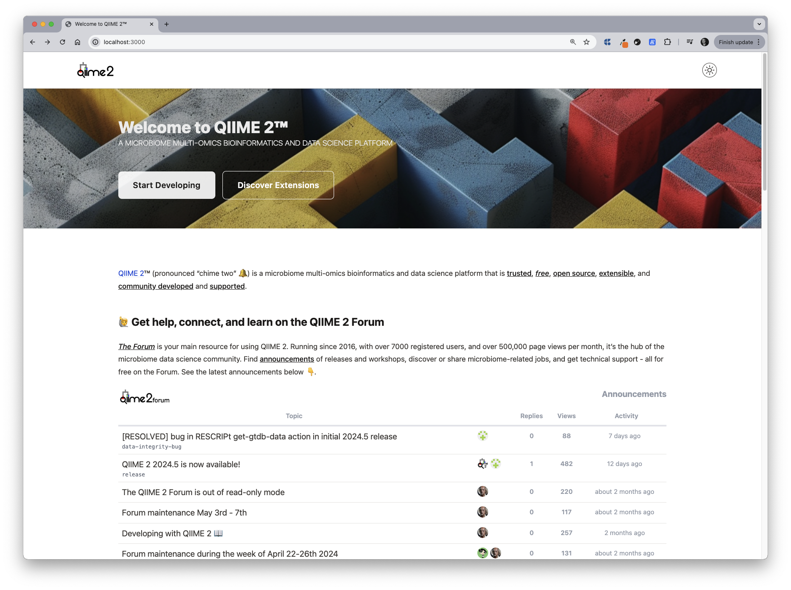

# QIIME 2 Landing Page

A MyST based landing page for the QIIME 2 project using the open source [Landing Page Theme](https://github.com/curvenote-themes/landing) and [custom roles & directives](https://github.com/myst-ext) by Curvenote.



## Features

- Site wide configuration - [see theme docs](https://github.com/curvenote-themes/landing)
- Configurable Hero & Footer Units - added using [custom "parts" in the theme]() along with [custom directives]()
- [A Discourse directive](https://github.com/myst-ext)
- [A Science Icons Role](https://github.com/curvenote/scienceicons)

## Content Development

Install the `curvenote` or `mystmd` CLI.

```sh
npm install -g mystmd
myst -v
```

```sh
cd qiime-landing
myst start
```

### Using a Theme

Theme selection and configuration is set by adding the appropriate keys to the `site` section of the `myst.yml` file. For example:

```yaml
site:
  template: curvenote/curvenote-landing
  options:
    logo: qiime2.svg
    favicon: images/qiime2-favicon-256.png
    topbar_height: 80
    topbar_floating: false
    topbar_fixed: false
    show_footnotes: false
    show_bibliography: false
```

### Using plugins

Add [custom myst plugins](https://github.com/myst-ext) to the site be adding a `plugins` list to the `project` section within `myst.yml`.
The `curvenote-landing` theme bundles the renderers for each of the plugins below, the MyST plugin system is still evolving, watch the [myst docs](https://mystmd.org/guide/plugins) for updates on how to include custom renderers.

```yaml
project:
  plugins:
    - scienceicons.mjs
    - discourse.mjs
    - curvenote-web.mjs
```

## Deployment

This site is deployed on github actions, see `.github/workflows/deploy.yml`.
